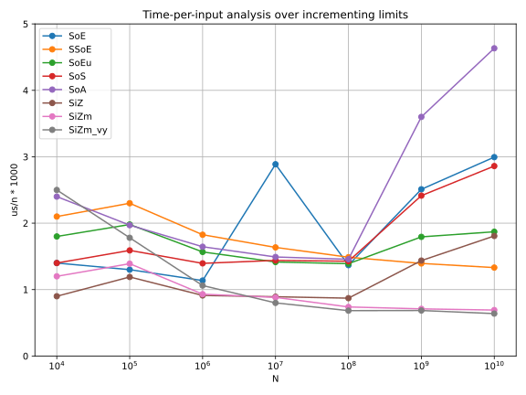
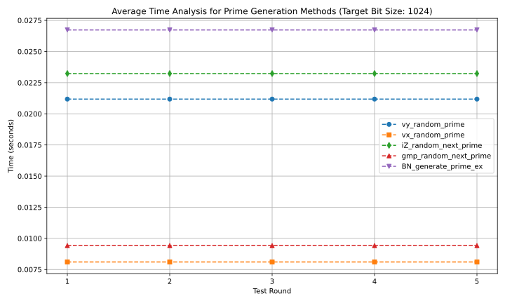
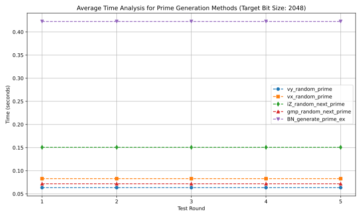
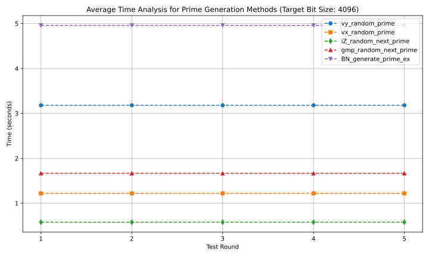

# Benchmarks

This document captures benchmark methodology, current result snapshots, and plotting usage for the iZprime project.

## 1. Run Benchmarks

From repository root:

```bash
make benchmark-p_sieve
make benchmark-p_gen
make benchmark-SiZ_count
```

Save results into `docs/test_results/`:

```bash
make benchmark-p_sieve save-results
make benchmark-p_gen save-results
make benchmark-SiZ_count save-results
```

Save results and generate plot artifacts automatically:

```bash
make benchmark-p_sieve plot
make benchmark-p_gen plot
```

Notes:

- `plot` implies `save-results`.
- Dash-style flags also work with GNU make passthrough:

```bash
make -- benchmark-p_sieve --save-results --plot
make -- benchmark-p_gen --save-results --plot
make -- benchmark-SiZ_count --save-results
```

Note: plotting is currently wired for `p_sieve` and `p_gen` result formats.

## 2. Result Files Used In This Snapshot

Sieve benchmark snapshot:

- `docs/test_results/psieve_10093442.txt`

Prime generation benchmark snapshots:

- `docs/test_results/p_gen_12094122.txt` (1024-bit)
- `docs/test_results/p_gen_12094126.txt` (2048-bit)
- `docs/test_results/p_gen_12094224.txt` (4096-bit)

SiZ_count benchmark snapshot:

- `docs/test_results/SiZ_count_19205134.txt`

## 3. Sieve Benchmark Table and Plot

Times are in microseconds (`us`) from `docs/test_results/psieve_10093442.txt`.

| Algorithm | 10^4 | 10^5 | 10^6 |  10^7 |   10^8 |    10^9 |    10^10 |
| --------- | ---: | ---: | ---: | ----: | -----: | ------: | -------: |
| SoE       |   14 |  130 | 1136 | 28874 | 136817 | 2510303 | 29944939 |
| SSoE      |   21 |  230 | 1826 | 16351 | 148737 | 1393887 | 13312626 |
| SoEu      |   18 |  198 | 1567 | 14153 | 139020 | 1793877 | 18707288 |
| SoS       |   14 |  159 | 1395 | 14393 | 142700 | 2414564 | 28599960 |
| SoA       |   24 |  197 | 1645 | 14909 | 145648 | 3600075 | 46331079 |
| SiZ       |    9 |  119 |  912 |  8924 |  87100 | 1436860 | 18074650 |
| SiZm      |   12 |  139 |  931 |  8825 |  73872 |  709836 |  6917661 |
| SiZm_vy   |   25 |  178 | 1061 |  7997 |  68305 |  684938 |  6385593 |



## 4. Prime Generation Benchmark Table

Average times are in seconds for each bit size from the corresponding `docs/test_results/p_gen_*.txt` files.

| Algorithm             |     1024 |     2048 |     4096 |
| --------------------- | -------: | -------: | -------: |
| vy_random_prime       | 0.021182 | 0.063515 | 3.181408 |
| vx_random_prime       | 0.008107 | 0.082872 | 1.220519 |
| iZ_random_next_prime  | 0.023231 | 0.150618 | 0.578747 |
| gmp_random_next_prime | 0.009421 | 0.071797 | 1.666787 |
| BN_generate_prime_ex  | 0.026731 | 0.422709 | 4.959384 |

## 5. Plot Artifacts

Current plot files:

- `docs/test_results/p_gen_12094122_avg.svg`
- `docs/test_results/p_gen_12094126_avg.svg`
- `docs/test_results/p_gen_12094224_avg.svg`

### Prime generation plots







## 6. SiZ_count Benchmark Table

Times are in seconds from `docs/test_results/SiZ_count_19205134.txt`.

Window size: `10^9` integers for each starting point.

| Start Point | Prime Count | Time (s) |
| ----------: | ----------: | -------: |
|      `10^10`|    43336106 |  0.157103 |
|      `10^20`|    21710426 | 45.271972 |
|      `10^30`|    14473890 | 50.446129 |
|      `10^40`|    10860250 | 75.721432 |
|      `10^50`|     8684378 | 83.009872 |
|      `10^60`|     7237481 | 107.691231 |
|      `10^70`|     6205976 | 119.342140 |
|      `10^80`|     5428021 | 167.147788 |
|      `10^90`|     4825182 | 178.556225 |
|     `10^100`|     4342289 | 218.545428 |

## 7. Plot From Terminal (Interactive Prompt)

You can generate/view plots directly from terminal. If no filepath is passed, scripts prompt for one:

```bash
python3 py_tools/plot_results.py
python3 py_tools/plot_p_sieve_results.py
python3 py_tools/plot_p_gen_results.py
```

Or pass a file explicitly:

```bash
python3 py_tools/plot_results.py output/psieve_10093442.txt --save
python3 py_tools/plot_results.py output/p_gen_12094224.txt --avg --save
```
