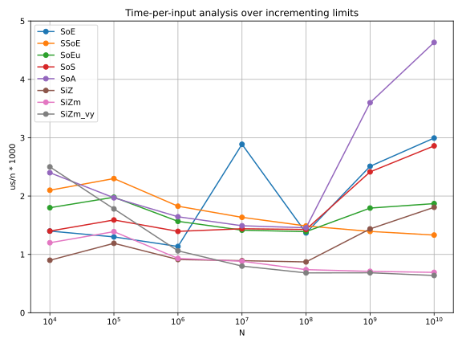
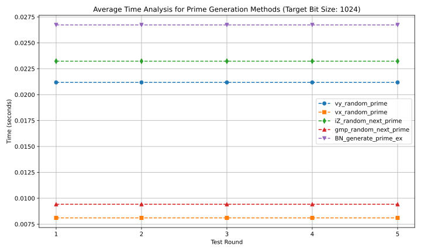
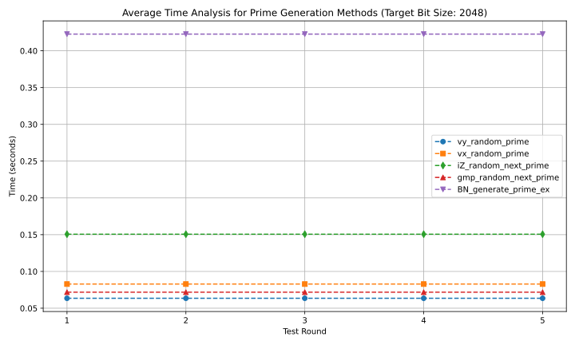
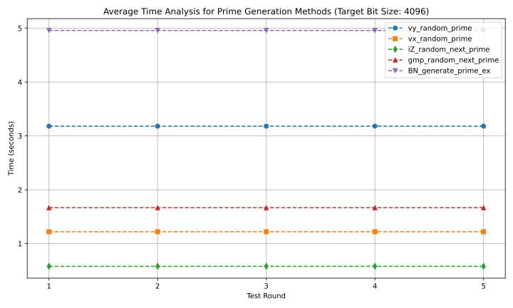

# Benchmarks

This document captures benchmark methodology, current result snapshots, and plotting usage for the iZprime project.

## 1. Run Benchmarks

From repository root:

```bash
make benchmark-p_sieve
make benchmark-p_gen
```

Save results into `docs/test_results/`:

```bash
make benchmark-p_sieve save-results
make benchmark-p_gen save-results
```

Save results and generate plot artifacts automatically:

```bash
make benchmark-p_sieve plot
make benchmark-p_gen plot
```

Notes:

- `plot` implies `save-results`.
- Dash-style flags also work with GNU make passthrough:

```bash
make -- benchmark-p_sieve --save-results --plot
make -- benchmark-p_gen --save-results --plot
```

## 2. Result Files Used In This Snapshot

Sieve benchmark snapshot:

- `docs/test_results/psieve_10093442.txt`

Prime generation benchmark snapshots:

- `docs/test_results/p_gen_12094122.txt` (1024-bit)
- `docs/test_results/p_gen_12094126.txt` (2048-bit)
- `docs/test_results/p_gen_12094224.txt` (4096-bit)

## 3. Sieve Benchmark Table and Plot

Times are in microseconds (`us`) from `docs/test_results/psieve_10093442.txt`.

| Algorithm | 10^4 | 10^5 | 10^6 |  10^7 |   10^8 |    10^9 |    10^10 |
| --------- | ---: | ---: | ---: | ----: | -----: | ------: | -------: |
| SoE       |   14 |  130 | 1136 | 28874 | 136817 | 2510303 | 29944939 |
| SSoE      |   21 |  230 | 1826 | 16351 | 148737 | 1393887 | 13312626 |
| SoEu      |   18 |  198 | 1567 | 14153 | 139020 | 1793877 | 18707288 |
| SoS       |   14 |  159 | 1395 | 14393 | 142700 | 2414564 | 28599960 |
| SoA       |   24 |  197 | 1645 | 14909 | 145648 | 3600075 | 46331079 |
| SiZ       |    9 |  119 |  912 |  8924 |  87100 | 1436860 | 18074650 |
| SiZm      |   12 |  139 |  931 |  8825 |  73872 |  709836 |  6917661 |
| SiZm_vy   |   25 |  178 | 1061 |  7997 |  68305 |  684938 |  6385593 |



## 4. Prime Generation Benchmark Table

Average times are in seconds from the corresponding `./test_results/p_gen_*.txt` files.

| Bit size | vy_random_prime | vx_random_prime | iZ_random_next_prime | gmp_random_next_prime | BN_generate_prime_ex |
| -------: | --------------: | --------------: | -------------------: | --------------------: | -------------------: |
|     1024 |        0.021182 |        0.008107 |             0.023231 |              0.009421 |             0.026731 |
|     2048 |        0.063515 |        0.082872 |             0.150618 |              0.071797 |             0.422709 |
|     4096 |        3.181408 |        1.220519 |             0.578747 |              1.666787 |             4.959384 |

## 5. Plot Artifacts

Current plot files:

- `./test_results/p_gen_12094122_avg.svg`
- `./test_results/p_gen_12094126_avg.svg`
- `./test_results/p_gen_12094224_avg.svg`

### Prime generation plots







## 6. Plot From Terminal (Interactive Prompt)

You can generate/view plots directly from terminal. If no filepath is passed, scripts prompt for one:

```bash
python3 py_tools/plot_results.py
python3 py_tools/plot_p_sieve_results.py
python3 py_tools/plot_p_gen_results.py
```

Or pass a file explicitly:

```bash
python3 py_tools/plot_results.py output/psieve_10093442.txt --save
python3 py_tools/plot_results.py output/p_gen_12094224.txt --avg --save
```
